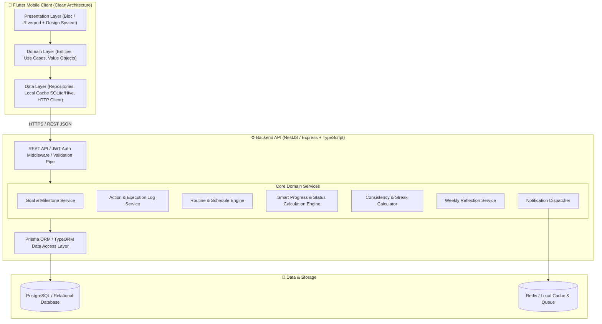
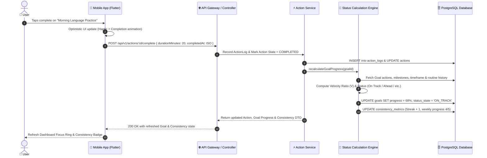
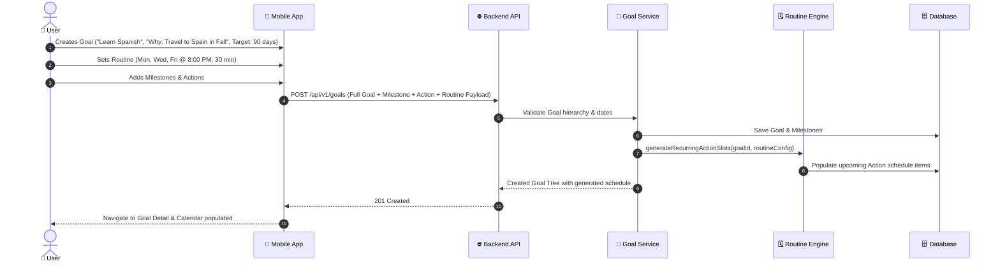
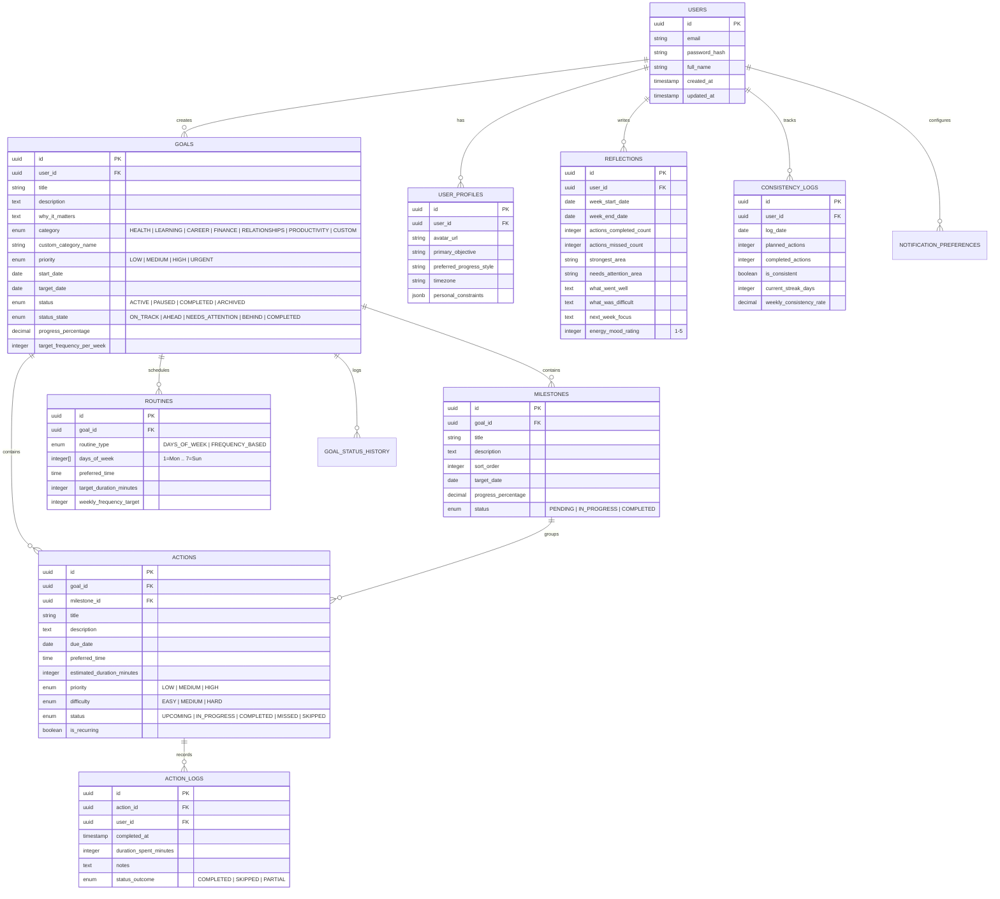

# Ascent: Intentional Goal & Routine System — Architecture & Design Blueprint

Ascent is a modern, consumer-grade mobile application designed to help users define personal goals, break them down into actionable milestones and routines, personalize how they achieve them, and understand their progress over time through calm, meaningful feedback.

Unlike traditional project management tools (Jira, Asana, ClickUp) that feel clinical and enterprise-heavy, **Ascent** is built around **personal intentionality, calm aesthetics, routine alignment, and non-toxic consistency**.

---

## 📱 Visual Design & UI/UX Preview

The visual design follows a dark-mode first, glassmorphic aesthetic with luminous jewel-toned accents (emerald for completed/on-track, warm violet for focus, amber for attention).

````carousel

<!-- slide -->

<!-- slide -->

````

---

## 1. System Architecture & High-Level Design

The system is architected as a decoupled, multi-tier full-stack application with strict separation of concerns, following **Clean Architecture** principles.



---

## 2. End-to-End Data Flow

### A. Daily Action Execution & Real-Time Status Recalculation Flow



### B. Goal Breakdown & Routine Binding Flow



---

## 3. Database Schema (PostgreSQL / Relational)



---

## 4. Smart Goal Status Calculation Engine (Mathematical Model)

Unlike naive apps that only divide completed items by total items ($completed / total$), Ascent computes a **Dynamic Velocity & Timeliness Index ($V$)**:

### Status Metrics Formulation

1. **Time Elapsed Ratio ($R_{time}$)**:
   $$R_{time} = \frac{\text{Current Date} - \text{Start Date}}{\text{Target Date} - \text{Start Date}}$$

2. **Expected Progress ($\text{Prog}_{expected}$)**:
   $$\text{Prog}_{expected} = \min(1.0, R_{time})$$

3. **Actual Progress ($\text{Prog}_{actual}$)**:
   $$\text{Prog}_{actual} = \frac{\sum \text{Completed Action Weights}}{\sum \text{Total Action Weights}}$$

4. **Velocity Factor ($V$)**:
   $$V = \frac{\text{Prog}_{actual}}{\text{Prog}_{expected}} \times \left(1 - 0.15 \times \frac{\text{Missed Actions in last 14d}}{\text{Scheduled Actions in last 14d}}\right)$$

### Status Classification Rules:

| Status State | Condition | UI Indication | Actionable Suggestion |
| :--- | :--- | :--- | :--- |
| 🟢 **Ahead** | $V \ge 1.15$ or $\text{Prog}_{actual} - \text{Prog}_{expected} \ge +15\%$ | Luminous Emerald Glow | "You're outpacing your target! Maintain or advance milestone." |
| 🔵 **On Track** | $0.85 \le V < 1.15$ | Serene Indigo/Cyan | "Cadence is healthy and aligned with your routine." |
| 🟡 **Needs Attention**| $0.60 \le V < 0.85$ or 2 consecutive missed routine slots | Warm Amber Pill | "Slight dip this week. Consider adjusting preferred time or reducing difficulty." |
| 🔴 **Behind** | $V < 0.60$ or projected end date slips $> 20\%$ | Soft Rose Accent | "Let's recalibrate: Reschedule upcoming actions or break down into smaller steps." |
| 🏆 **Completed** | $\text{Prog}_{actual} = 100\%$ | Golden Shimmer | "Milestone/Goal achieved! Ready for reflection and archive." |

---

## 5. Non-Toxic Consistency & Routine Engine

Traditional daily streaks create anxiety and guilt when a user skips a single day due to sickness or rest. **Ascent's Consistency Model** is built around:

1. **Rest Day Respect**: If a routine is configured for Mon/Wed/Fri, Tuesday and Thursday are scheduled **Recovery Days**, not broken streak days.
2. **Weekly Cadence Targets**: e.g., "4 / 4 sessions this week" rather than an inflexible 30-day continuous chain.
3. **Graceful Rescheduling ("Life Happens")**: Users can mark an action as *Rescheduled* without penalizing their consistency score.
4. **Consistency Rate**: Rolling 7-day and 30-day consistency percentage:
   $$\text{Consistency Rate} = \frac{\text{Completed Planned Sessions}}{\text{Total Scheduled Sessions}} \times 100\%$$

---

## 6. Comprehensive Screen-by-Screen Breakdown (17 Screens)

1. **Splash Screen**: Animated Ascent brand emblem, calm gradient transition, session validator.
2. **Onboarding Wizard (3-Steps)**:
   - Step 1: Personal Profile (Name, avatar, primary life focus).
   - Step 2: First Goal & "Why it matters" definition.
   - Step 3: Preferred rhythm (Morning vs Evening, Target days, Progress style: Milestone-driven vs Routine-driven).
3. **Authentication Screens**: Login, Sign Up, Forgot Password, Token refresh, biometric ready.
4. **Home Dashboard**:
   - Personalized header with time-of-day greeting & consistency pill.
   - *Today's Focus Ring* (Circular interactive progress widget).
   - *Active Goals Carousel* (Cards with category, title, status pill, progress bar).
   - *Today's Action Flow* (Morning, Afternoon, Evening action cards with check-off).
   - Quick action Floating Action Button.
5. **Goals Explorer Screen**: Filter by category, status (Active, Paused, Completed), sort by priority/date.
6. **Create / Edit Goal Modal**: Rich form with category selector, custom category creation, priority, date pickers, "Why it matters" prompt, routine frequency picker.
7. **Goal Details & Breakdown Screen**:
   - Header with status badge, progress ring, timeframe bar.
   - Routine Card (e.g. Mon, Wed, Fri @ 8 PM).
   - Milestones Tree with expandable/collapsible Action checklists.
   - History & status notes tab.
8. **Create Milestone Modal**: Title, target date, order, description.
9. **Create Action Modal**: Title, milestone assignment, duration estimate, preferred time slot, priority, difficulty.
10. **Today's Actions Screen**: Dedicated focus mode with filter by time slot, batch complete, quick reschedule.
11. **Interactive Calendar & Schedule**:
    - Month / Week view.
    - Colored indicator dots for scheduled routines and milestones.
    - Day agenda detail list below the calendar.
12. **Deep Progress Analytics Screen**:
    - 4-week consistency trend chart.
    - Category balance breakdown (Health vs Career vs Learning).
    - Velocity stats & completed action count.
13. **Weekly Reflection & Review Screen**:
    - "Week in Review" summary cards (Actions done, rescheduled, consistency %).
    - AI-assisted highlights ("Strongest Area", "Needs Attention").
    - Reflective journal inputs ("What went well?", "What made things difficult?").
    - "Set Next Week's Priorities" action.
14. **User Profile Screen**: Total goals accomplished, lifetime actions, routine adherence, personal statement.
15. **App Settings**: Theme (Dark/Light/System), data export, account management.
16. **Notification Preferences**: Customizable reminders for morning focus, evening check-in, weekly reflection alerts.
17. **Routine Management**: Dedicated view to view and adjust weekly routine slots across all active goals.

---

## 7. Proposed Implementation Plan

### Phase 1: Backend Foundation & API Services (Node.js + TypeScript + Express/NestJS + Prisma/PostgreSQL)
- Initialize backend workspace structure with TypeScript, Express/NestJS, Prisma ORM, and JWT authentication.
- Implement database models and migrations for Users, Goals, Milestones, Actions, ActionLogs, Routines, Reflections, and Consistency.
- Build REST API controllers, DTOs with validation, and comprehensive services:
  - Auth Controller & Service (Register, Login, Me, Token Refresh)
  - Goals Controller & Service (CRUD, Pause, Resume, Complete, Hierarchy tree)
  - Milestones & Actions Controller & Service (CRUD, Complete action, Reorder, Action logs)
  - Routines Controller & Service
  - Status Calculation Engine (Velocity factor, On Track / Behind / Ahead calculation)
  - Consistency & Weekly Reflection Controller & Service
  - Dashboard Aggregator Controller (`/api/v1/dashboard/today`)
  - Notification Configuration Controller

### Phase 2: Mobile Application Architecture & Core Design System
- Setup mobile client with clean architecture structure (Presentation, Domain, Data layers).
- Build the **Ascent Design System**:
  - Typography (Inter / Outfit styled text themes)
  - Color Palette (Deep dark obsidian background `#0D1117`, card surface `#161B22`, luminous violet `#8B5CF6`, emerald `#10B981`, cyan `#06B6D4`, amber `#F59E0B`)
  - Glassmorphic card containers, glowing status badges, smooth circular progress rings, custom animated checkboxes, haptic feedback hooks.
  - State management (BLoC / Riverpod pattern with immutable states and clean event handling).

### Phase 3: Screen Development & Interactive User Journey
- Implement all 17 screens faithfully matching the high-end consumer UI/UX aesthetics.
- Implement dynamic forms with validation for goal creation, milestone breakdown, and action scheduling.
- Implement Interactive Dashboard, Focus Ring, Calendar view, and Weekly Reflection Journaling.

### Phase 4: Verification & End-to-End User Journey Testing
- Automated backend unit & integration tests for status calculation algorithms, consistency scoring, and auth.
- Full verification of the Primary User Journey from registration -> onboarding -> goal creation -> routine breakdown -> action checkoff -> progress recalculation -> weekly reflection.
